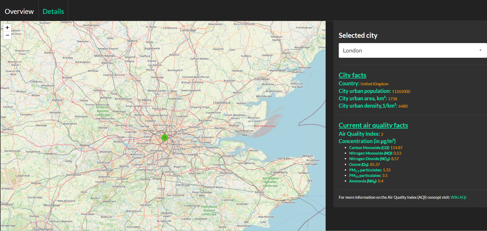

<h1>🌍 Pollution Map (R Markdown + Shiny App)</h1>

This project demonstrates the development of an interactive <strong>pollution map</strong> built in  R <strong>R</strong> using 
<strong>R Markdown</strong>, <strong>Shiny</strong>, <strong>API integration</strong>, and <strong>web scraping</strong>.

<h2>Workflow Includes:</h2>

<ul>
  <li>Collecting air quality and geographic data via APIs and web scraping</li>
  <li>Cleaning and preprocessing raw data</li>
  <li>Visualizing pollution levels on an interactive world map</li>
  <li>Building a Shiny interface for city-level exploration</li>
  <li>Documenting the full analytical workflow in R Markdown</li>
  <li>Launching a complete Shiny app automatically at the end of the knitted HTML</li>
</ul>

<h2>🔧 App Features</h2>

<h3>🗺️ Tab 1 — World Overview Map</h3>
<ul>
  <li>Displays all cities included in the dataset</li>
  <li>Each city is represented by a colored circle marker indicating pollution severity</li>
  <li>Colors map to air quality levels for fast comparison</li>
  <li>Data sourced through APIs and web scraping</li>
  <li>Useful for understanding global pollution patterns at a glance</li>
</ul>

<h3>📍 Tab 2 — City Explorer</h3>
<ul>
  <li>Dropdown menu to select any specific city</li>
  <li>Map automatically zooms to the chosen location</li>
  <li>Side panel displays detailed pollutant metrics</li>
  <li>Helps users explore detailed, city-specific air quality values</li>
</ul>

<h2>📂 Repository Structure</h2>

<pre>
pollution-map-project-r/
├── Pollution_html.Rmd        # Full workflow + Shiny app
├── data/
│   └── cities_coord.rds      # Preprocessed dataset
├── screenshots/
│   ├── Overview.png          # Screenshot of the global map
│   └── Details.png           # Screenshot of city-specific tab
└── README.md
</pre>

<h2>🖼️ Screenshots</h2>

<h3>🌍 Overview Map</h3>

<h3>📍 City Details View</h3>

<h2>▶️ How to Run</h2>

<h3>Option 1 — Knit the R Markdown (recommended)</h3>
<ol>
  <li>Open <code>Pollution_html.Rmd</code> in RStudio</li>
  <li>Click <strong>Knit → Knit to HTML</strong></li>
</ol>

This will produce:

<ul>
  <li>A rendered HTML document showing the full workflow</li>
  <li>A Shiny application window launching automatically at the end</li>
</ul>

<h3>Option 2 — Run only the Shiny app</h3>

Scroll to the final Shiny code chunk inside the R Markdown file and run it manually.

<h2>📦 Required R Packages</h2>

<pre>
install.packages(c(
  "dplyr",
  "leaflet",
  "sf",
  "shiny",
  "ggplot2",
  "knitr",
  "rvest",
  "tidyverse",
  "RKaggle",
  "httr",
  "jsonlite"
))
</pre>

<h2>📘 Purpose of the Project</h2>

<ul>
  <li>Demonstrating spatial visualization techniques in R</li>
  <li>Integrating <strong>Shiny</strong> inside an <strong>R Markdown</strong> workflow</li>
  <li>Using APIs and web scraping for reproducible data collection</li>
  <li>Preprocessing and analyzing pollution datasets</li>
  <li>Building interactive dashboards for geographic insights</li>
</ul>
